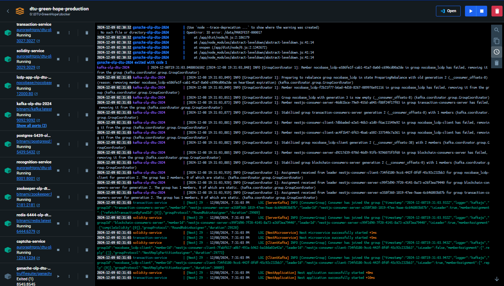

# 🌱 Hi Vọng Xanh: Nền Tảng Hỗ Trợ Sau Thiên Tai

> *"🤝 Kết nối yêu thương, kiến tạo tương lai bền vững 🌿"*

## 📋 Tổng quan

Hi Vọng Xanh là một nền tảng tiên tiến hỗ trợ sau thiên tai, được thiết kế để kết nối cộng đồng, quản lý cứu trợ và mang lại hy vọng mới cho những vùng bị ảnh hưởng bởi thiên tai.
Hệ thống kết hợp các công nghệ hiện đại để đảm bảo minh bạch, hiệu quả, và tốc độ trong việc triển khai cứu trợ.

## 💫 Giá trị cốt lõi

1. **🔍 Minh bạch** - Hỗ trợ sao kê giao dịch
2. **⚡ Hiệu quả** - Tối ưu hóa quy trình phân phối cứu trợ bằng AI
3. **🌱 Bền vững** - Phát triển các giải pháp dài hạn cho cộng đồng
4. **🚀 Đổi mới** - Không ngừng cải tiến công nghệ và phương pháp tiếp cận

## 🏗️ Kiến trúc hệ thống


### 💻 Công nghệ nền tảng

| Công nghệ | Chức năng | Ưu điểm |
|-----------|-----------|----------|
| 📱 TypeScript & NestJS | Phát triển backend | Độ tin cậy cao, khả năng mở rộng linh hoạt |
| 🤖 Python & TensorFlow | Xử lý AI/ML | Nhận diện nhanh vùng thiên tai qua ảnh vệ tinh |
| 📊 PostgreSQL & TimescaleDB | Quản lý dữ liệu thời gian thực | Hiệu suất cao, phân tích dữ liệu chuyên sâu |
| 🔗 NocoBase |	Triển khai hệ thống LCDP để quản lý cấu hình và hỗ trợ phát triển nhanh. | Phát triển ứng dụng nhanh, hiệu năng vượt trội
| 📡 Apache Kafka | Message Queue | Xử lý realtime, khả năng chịu tải cao |
| 🔄 Redis | Cache & Queue | Tối ưu hiệu năng, giảm tải database |

### 🔧 Các module chính

1. **🎯 Module Nhận diện thiên tai**
   - Phân tích ảnh vệ tinh theo thời gian thực
   - Đánh giá mức độ thiệt hại tự động
   - Dự báo nhu cầu cứu trợ

2. **💰 Module Quản lý nguồn lực**
   - Theo dõi phân phối hàng cứu trợ
   - Báo cáo tác động theo thời gian thực
   - Quản lý nguồn lực cộng đồng

3. **🤝 Module Kết nối cộng đồng**
   - Nền tảng tình nguyện viên
   - Hệ thống điều phối cứu trợ
   - Mạng lưới hỗ trợ địa phương

## 📊 Nghiên cứu & Phát triển

### 🔬 Các lĩnh vực nghiên cứu

1. **🧠 Trí tuệ nhân tạo trong cứu trợ**
   - Dự đoán nhu cầu cứu trợ
   - Tối ưu hóa lộ trình phân phối
   - Phân tích dữ liệu cộng đồng

2. **🌍 Phát triển bền vững**
   - Đánh giá tác động môi trường
   - Giải pháp năng lượng xanh
   - Mô hình kinh tế tuần hoàn

## 🔧 Hướng dẫn cài đặt

### 🛠 Công cụ cần thiết

- [Docker](https://www.docker.com/products/docker-desktop/) - Công cụ đóng gói phần mềm

## 📥 Tải mã nguồn về máy

  Mở terminal (bash) và thực hiện một trong hai lệnh sau:

  ```bash
    git clone https://github.com/olp-dtu-2024/DTU-GreenHope.git
    # hoặc
    git clone git@github.com:olp-dtu-2024/DTU-GreenHope.git
  ```

### 💁 Cho production

#### 1️⃣ Cài đặt môi trường Docker cho dự án

  Mở terminal tại thư mục tổng của dự án
  
  ```bash
    yarn docker:release
```

  > ***⚠️ Lưu ý***: kiểm tra tất cả các tác vụ trong **_Container_** đã chạy được hết như hình sau:

  

#### 2️⃣ Khởi chạy dự án

Tại Container của dự án, bạn chọn và mở **`lcdp-dtu-2024`**

### 💻 Cho development

#### 1️⃣ Cài đặt môi trường Docker cho dự án

Mở terminal tại thư mục tổng của dự án
  
  ```bash
    yarn docker:build
```

  > ***⚠️ Lưu ý***: kiểm tra tất cả các tác vụ trong **_Container_** đã chạy được hết như hình sau:

  <!--  -->

#### 2️⃣ Cài đặt thư viện

**Bước 1: Cài đặt thư viện cho dự án**:

- Mở terminal ở thư mục tổng chạy lệnh sau:
  
```bash
    yarn install
```

**Bước 2: Cài đặt thư viện nocobase**:

- Mở terminal ở thư mục tổng chạy lệnh sau:
  
```bash
    cd lcdp-app
    yarn install
```

**Bước 3: Cài đặt thư viện cho transaction service**:

- Mở terminal ở thư mục tổng chạy lệnh sau:
  
```bash
    cd transaction-service
    yarn install
```

**Bước 4: Cài đặt thư viện cho solidity service**:

- Mở terminal ở thư mục tổng chạy lệnh sau:
  
```bash
    cd solidity-service
    yarn install
```

#### 3️⃣ Cài dữ liệu dự án

- Mở terminal ở thư mục tổng chạy lệnh sau:
  
```bash
    cd lcdp-app
    yarn lcdp:restore
```

#### 4️⃣ Khởi chạy dự án

**Bước 1: Khởi chạy nocobase**:

- Mở terminal ở thư mục tổng chạy lệnh sau:
  
```bash
    cd lcdp-app
    yarn dev
```

**Bước 2: Khởi chạy transaction service**:

- Mở terminal ở thư mục tổng chạy lệnh sau:
  
```bash
    cd transaction-service
    yarn dev
```

**Bước 3: Khởi chạy solidity service**:

- Mở terminal ở thư mục tổng chạy lệnh sau:
  
```bash
    cd solidity-service
    yarn dev
```

## 🎠 Hướng dẫn sử dụng

## 🌿 Kỳ vọng tương lai

Chúng tôi hướng đến việc kết hợp thêm các công nghệ bền vững, hỗ trợ AI để tối ưu cứu trợ và giúp đỡ cộng đồng trong thời gian thực. Cùng nhau, chúng ta xây dựng một thế giới tốt đẹp hơn!

## 👩‍🏫 Giảng viên hướng dẫn

- 📝 **Name**: Nguyễn Quốc Long
- 📧 **Email**: quoclongdng@gmail.com

---

## 📞 Liên hệ & Kết nối

- 📧 **Email**: minhtuanledng@gmail.com
- 📱 **Hotline**: +84 889 001 505

---

*© 2024 Hi Vọng Xanh - Vì một tương lai bền vững* 🌱
