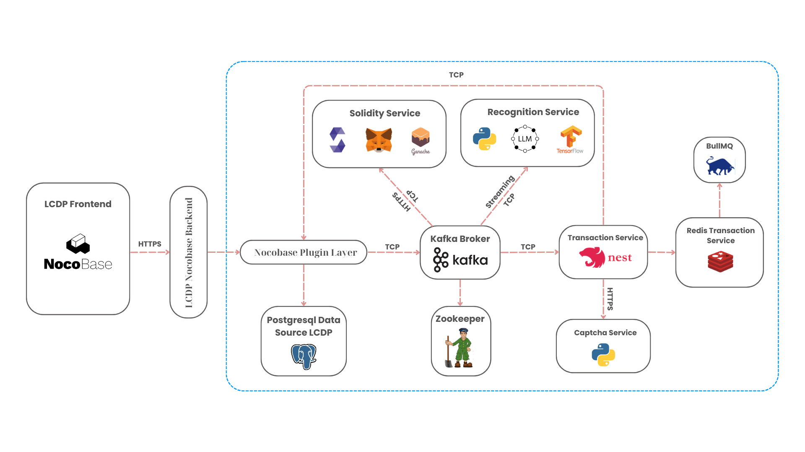

<div align="center">
  
  
  # Hi Vọng Xanh 🌱 
  ### Nền Tảng Hỗ Trợ Sau Thiên Tai

  > *"🤝 Kết nối yêu thương, kiến tạo tương lai bền vững 🌿"*

  [](LICENSE)

  <a href="https://dz.minhtuandng.id.vn">
    
  </a>
  
  <a href="http://green-hope.minhtuandng.id.vn/docs/intro">
    
  </a>
     <a href="https://www.youtube.com/watch?v=3wavVUV8V9M">
    
  </a>

  [📖 Tài Liệu](http://green-hope.minhtuandng.id.vn/docs/intro) • 
  [🚀 Demo](https://dz.minhtuandng.id.vn) • 
  [🤝 Đóng Góp](CONTRIBUTING.md) • 
  [📜 Changelog](CHANGELOG.md)
</div>

## 📋 Tổng Quan

**Hi Vọng Xanh** là một *mã nguồn mở*, được phát triển bởi đội **DTU_DZ1** đến từ Đại học Duy Tân để tham gia cuộc thi Olympic Tin học Sinh viên - Mã nguồn mở năm 2024. Dự án được thiết kế trong lĩnh vực hỗ trợ sau thiên tai, với các mục tiêu:

- 🔗 **Kết nối** cộng đồng một cách hiệu quả
- 📊 **Quản lý** nguồn lực cứu trợ một cách chuyên nghiệp
- 💡 **Mang lại hy vọng** cho những vùng bị ảnh hưởng
- 📝 **Minh bạch** dữ liệu giao dịch trong ủng hộ

Dự án tập trung vào việc xây dựng một nền tảng toàn diện, kết hợp công nghệ hiện đại như Blockchain, AI và xử lý dữ liệu thời gian thực để tạo ra một hệ sinh thái hỗ trợ thiên tai minh bạch và hiệu quả.

## 🏗️ Kiến trúc hệ thống



### 💻 Công Nghệ Nền Tảng

| 🛠️ Công Nghệ | 🎯 Chức Năng | 🌟 Ưu Điểm |
|--------------|--------------|-------------|
| TypeScript & NestJS | Phát triển backend | Độ tin cậy cao, khả năng mở rộng linh hoạt | Xử lý AI/ML | Nhận diện nhanh vùng thiên tai qua ảnh vệ tinh |
| PostgreSQL & TimescaleDB | Quản lý dữ liệu thời gian thực | Hiệu suất cao, phân tích chuyên s��u |
| NocoBase | Quản lý cấu hình và hỗ trợ phát triển | Phát triển ứng dụng nhanh, hiệu năng vượt trội |
| Apache Kafka | Message Queue | Xử lý realtime, khả năng chịu tải cao |
| Redis | Cache & Queue | Tối ưu hiệu năng, giảm tải database |
| Ganache | Local Ethereum Blockchain | Phát triển và kiểm thử smart contract |
| Etherium | Ethereum Network | Nền tảng blockchain tân tiến nhất hiện nay |
| Solidity | Smart Contract | Ngôn ngữ phát triển hợp đồng thông minh |

## 🔧 Các Module Chính

#### 1. 🎯 Module Nhận Diện Thiên Tai
- 🔍 Phân tích ảnh theo thời gian thực
- 🚁 Tìm kiếm người gặp nạn trong thiên tai
- 🤖 Nhận diện kịp thời con người và động vật

#### 2. 💰 Module Sao Kê Giao Dịch
- 📊 Theo dõi các giao dịch cứu trợ
- 🕒 Báo cáo theo thời gian thực
- 🏗️ Quản lý nguồn lực xây dựng cứu trợ

#### 3. 🤝 Module Blockchain
- ⛓️ Mạng lưới blockchain để lưu trữ dữ liệu giao dịch
- 🔄 Sao kê, so sánh dữ liệu giữa database với blockchain

## 🔧 Yêu Cầu Hệ Thống

### 🛠️ Phần Mềm Bắt Buộc
- 🐳 Docker Desktop - [Tải tại đây](https://www.docker.com/products/docker-desktop/)
- 🧶 Yarn phiên bản 1.2.1 (Yêu cầu bởi Nocobase)
- 🌳 Git


## 📝 Ghi Chú Quan Trọng

> **Lưu ý về NocoBase và Yarn Workspace:**
>
> - Nocobase ([Tài liệu chính thức](https://docs.nocobase.com/welcome/getting-started/installation/create-nocobase-app)) yêu cầu Yarn phiên bản 1.22.x
> - Yarn 1.22.x không hỗ trợ workspace public
> - Vì đây là dự án mã nguồn mở, chúng tôi đã để `private = false` trong `lcdp-app/package.json`
> - Để phát triển tiếp dự án, bạn cần:
>   - Mở file `lcdp-app/package.json`
>   - Thay đổi trường `private` từ `false` thành `true`
>   - Sau đó có thể tiếp tục phát triển bình thường

## 📥 Hướng Dẫn Cài Đặt Chi Tiết

#### 🏭 Môi Trường Production
#### [Hướng dẫn sử dụng bằng video](https://www.youtube.com/watch?v=eQz5lOKj9n0)
```bash
# Tải mã nguồn về
git clone https://github.com/olp-dtu-2024/DTU-GreenHope.git

# Di chuyển vào thư mục dự án
cd DTU-GreenHope

# Cài đặt các gói phụ thuộc
yarn install

# Khởi chạy docker cho môi trường production
yarn docker:release
```

**🔐 Thông tin đăng nhập mặc định:**
- 👤 Tài khoản: `admin@nocobase.com`
- 🔑 Mật khẩu: `admin123`


### 💻 Môi Trường Development

#### Bước 1: Cài đặt dự án
```bash
# Tải mã nguồn về
cd DTU-GreenHope
yarn install
yarn docker:build
```

#### Bước 2: Cài Đặt LCDP App (NocoBase)
```bash
# Cài đặt và cấu hình NocoBase
cd DTU-GreenHope/lcdp-app
# Mở file package.json và thay đổi trường private từ false thành true
yarn install
yarn nocobase install --lang=en-US
yarn lcdp:restore
yarn dev
```
Máy chủ phát triển sẽ chạy tại: http://localhost:13000
#### Bước 3: Cài đặt transaction service
```bash
# Cài đặt dự án
cd DTU-GreenHope/transaction-service
yarn install
yarn dev
```
#### Bước 4: Cài đặt solidity service
```bash
# Cài đặt dự án
cd DTU-GreenHope/solidity-service
yarn install
yarn dev
```
#### Bước 5: Cài đặt recognition service
```bash
# Cài đặt dự án
cd DTU-GreenHope/recognition-service
pip install -r requirements.txt
python app.py
```
#### Bước 6: Cài đặt captcha service
```bash
# Cài đặt dự án
cd DTU-GreenHope/captcha-service
pip install -r requirements.txt
python app.py
```

## 🔐 Kết nối metamask với provider Ganache:**
### Mở metamask và tạo mới mạng local với thông tin
- Network name: Ganache Local
- Default RPC URL: http://localhost:8545
- Chain Id: 1337
- Currency symbol: ETH
  
**🔐 Thông tin các địa chỉ ví trên Ganache:**
| Account Address                                         | Private Key                                                                                       |
|---------------------------------------------------------|--------------------------------------------------------------------------------------------------|
| 0x90F8bf6A479f320ead074411a4B0e7944Ea8c9C1             | 0x4f3edf983ac636a65a842ce7c78d9aa706d3b113bce9c46f30d7d21715b23b1d                         |
| 0xFFcf8FDEE72ac11b5c542428B35EEF5769C409f0             | 0x6cbed15c793ce57650b9877cf6fa156fbef513c4e6134f022a85b1ffdd59b2a1                         |
| 0x22d491Bde2303f2f43325b2108D26f1eAbA1e32b             | 0x6370fd033278c143179d81c5526140625662b8daa446c22ee2d73db3707e620c                         |
| 0xE11BA2b4D45Eaed5996Cd0823791E0C93114882d             | 0x646f1ce2fdad0e6deeeb5c7e8e5543bdde65e86029e2fd9fc169899c440a7913                         |
| 0xd03ea8624C8C5987235048901fB614fDcA89b117             | 0xadd53f9a7e588d003326d1cbf9e4a43c061aadd9bc938c843a79e7b4fd2ad743                         |
| 0x95cED938F7991cd0dFcb48F0a06a40FA1aF46EBC             | 0x395df67f0c2d2d9fe1ad08d1bc8b6627011959b79c53d7dd6a3536a33ab8a4fd                         |
| 0x3E5e9111Ae8eB78Fe1CC3bb8915d5D461F3Ef9A9             | 0xe485d098507f54e7733a205420dfddbe58db035fa577fc294ebd14db90767a52                         |
| 0x28a8746e75304c0780E011BEd21C72cD78cd535E             | 0xa453611d9419d0e56f499079478fd72c37b251a94bfde4d19872c44cf65386e3                         |
| 0xACa94ef8bD5ffEE41947b4585a84BdA5a3d3DA6E             | **0x829e924fdf021ba3dbbc4225edfece9aca04b929d6e75613329ca6f1d31c0bb4**                         |
| 0x1dF62f291b2E969fB0849d99D9Ce41e2F137006e             | 0xb0057716d5917badaf911b193b12b910811c1497b5bada8d7711f758981c3773                         |
## 🔌 Phát Triển Plugin Mới
```bash
# Tạo plugin mới
yarn pm create @<tên-namespace>/<tên-package>

# Ví dụ
yarn pm create @greenhope/theo-doi-thien-tai
```

## 🔗 Cấu Hình Ports

| 🚦 Dịch Vụ | 🏭 Ports Production | 💻 Ports Development | 📝 Mô Tả |
|------------|:-------------------:|:-------------------:|-----------|
| 📦 LCDP NOCOBASE | `12000:12000` | `13000` | Nền tảng ứng dụng chính |
| 🤖 Recognition Service | `8001:8001` | `8001` | Dịch vụ nhận diện |
| 💱 Transaction Service | `3027:3027` | `3027` | Trung tâm xử lý giao dịch |
| 🔗 Solidity Service | `3029:3029` | `3029` | Tương tác hợp đồng blockchain |
| 🛡️ Captcha Service | `1234:1234` | `1234` | Hệ thống xác minh giải mã |
| 📡 Kafka | `9092:9092` <br> `9093:9093` | `9092` <br> `9093` | Nền tảng streaming phân tán |
| 💾 Redis | `6444:6379` | `6444` | Kho dữ liệu trong bộ nhớ |
| 🗃️ PostgreSQL | `5439:5432` | `5439` | Hệ quản trị cơ sở dữ liệu |
| ⛓️ Ganache | `8545:8545` | `8545` | Blockchain Ethereum cục bộ |
| 🌳 Zookeeper | `2181:2181` | `2181` | Quản lý tin nhắn Kafka |

## 📦 Các Package Phát Triển Trong Nền Tảng
- [@dtu-olp-2024/carousel-nocobase](https://www.npmjs.com/package/@dtu-olp-2024/carousel-nocobase)
- [@dtu-olp-2024/kafka-nocobase](https://www.npmjs.com/package/@dtu-olp-2024/kafka-nocobase)
- [@dtu-olp-2024/progress-nocobase](https://www.npmjs.com/package/@dtu-olp-2024/progress-nocobase)
- [@dtu-olp-2024/rich-block-nocobase](https://www.npmjs.com/package/@dtu-olp-2024/rich-block-nocobase)
- [@dtu-olp-2024/vietqr-nocobase](https://www.npmjs.com/package/@dtu-olp-2024/vietqr-nocobase)
- [@dtu-olp-2024/landing-page](https://www.npmjs.com/package/@dtu-olp-2024/landing-page)
- [@dtu-olp-2024/solidity-editor-nocobase](https://www.npmjs.com/package/@dtu-olp-2024/solidity-editor-nocobase)
- [@dtu-olp-2024/video-player-nocobase](https://www.npmjs.com/package/@dtu-olp-2024/video-player-nocobase)
## 🤝 Đóng Góp Cho Dự Án

### 🌱 Quy Trình Đóng Góp

1. **Fork Repository**
```bash
# Fork repository trên GitHub
# Clone về máy local
git clone https://github.com/<your-username>/DTU-GreenHope.git
cd DTU-GreenHope
```
2. Tạo Branch Mới
```bash
# Tạo và chuyển sang branch mới
git checkout -b feat/<new-feature>

# Ví dụ
git checkout -b feat/disaster-tracking
```
3. Commit Thay Đổi
```bash
# Thêm file đã thay đổi
git add .

# Commit với message rõ ràng
git commit -m "feat: add disaster tracking module"
```
4. Push Branch
  ```bash
  # Push lên repository của bạn
git push -u origin feat/<new-feature>
```
5. Tạo Pull Request
- Truy cập repository gốc tại GitHub
- Chọn "New Pull Request"
- Chọn branch của bạn để merge
- Điền thông tin mô tả chi tiết

📝 Lưu ý: Vui lòng đọc kỹ [git-flow.md](git-flow.md) để hiểu rõ về quy trình làm việc với Git trong dự án.
## 👥 Người Hướng Dẫn


| 👨‍🏫 Vai Trò | 📧 Thông Tin |
|------------|--------------|
| Giảng Viên | Nguyễn Quốc Long |
| Email | quoclongdng@gmail.com |

## 📞 Liên Hệ

| 📬 Phương Thức | 📱 Chi Tiết |
|---------------|-------------|
| Email | minhtuanledng@gmail.com |
| Hotline | +84 889 001 505 |

## 📜 Changelog
Xem [CHANGELOG.md](CHANGELOG.md) để biết lịch sử thay đổi.

## ⚖️ Quy Tắc Ứng Xử

Dự án này tuân theo bộ quy tắc ứng xử cho cộng đồng. Xem file [CODE_OF_CONDUCT.md](CODE_OF_CONDUCT.md) để biết thêm chi tiết về các quy tắc và hành vi được chấp nhận.

## 🐛 Báo Cáo Lỗi & Góp Ý

### 📝 Issues
- Báo cáo lỗi và đề xuất tính năng mới tại [GitHub Issues](https://github.com/olp-dtu-2024/DTU-GreenHope/issues)

### 🔒 Bảo Mật
- Đối với các vấn đề bảo mật nhạy cảm, vui lòng liên hệ trực tiếp qua email: minhtuanledng@gmail.com

## 📄 Giấy Phép

Dự án này được phân phối dưới [GNU General Public License v3.0](LICENSE). Xem file `LICENSE` để biết thêm chi tiết.

---

*© 2024 Hi Vọng Xanh - Vì một tương lai bền vững* 🌱
