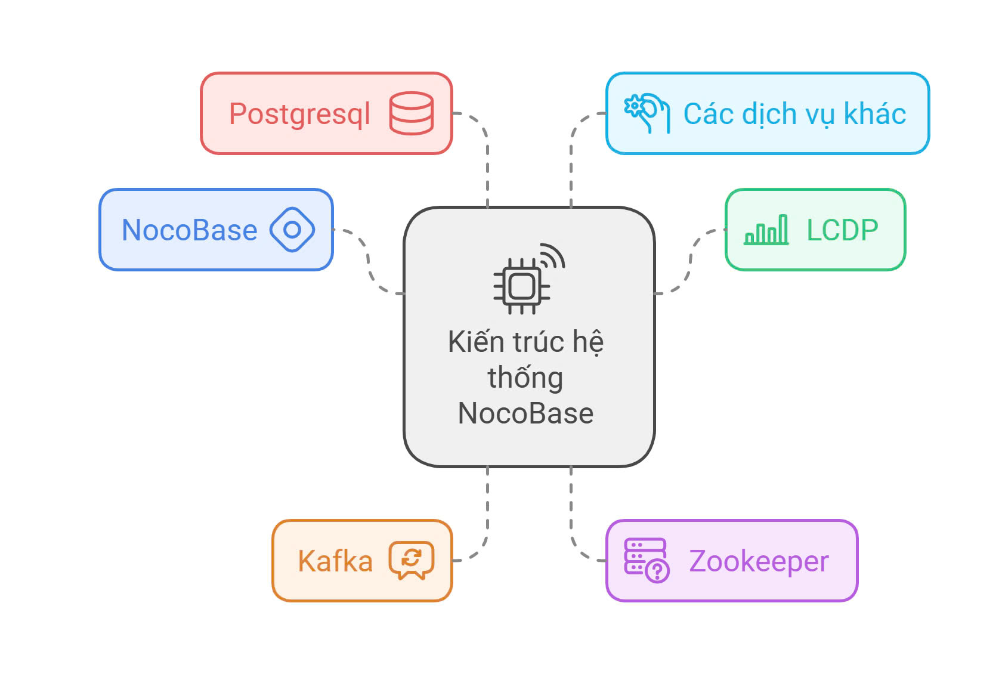
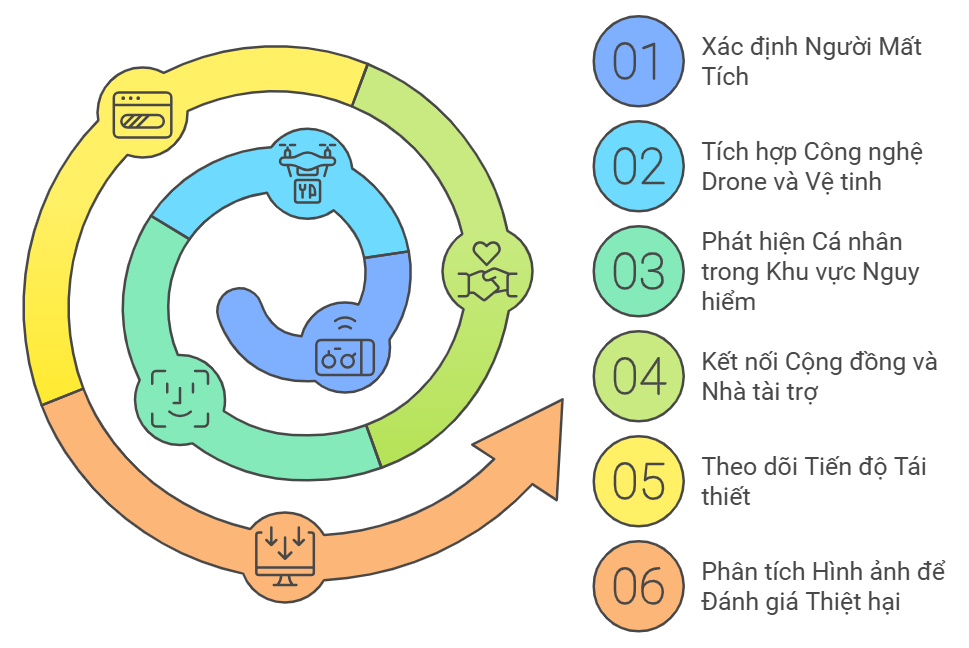

# Kiến trúc hệ thống
## 📐 Hệ thống
Thiết kế theo kiến trúc microservices như hình vẽ bên dưới:


## 🕹️ Các thành phần chính và chức năng:



- NocoBase: Là nền tảng cốt lõi, cung cấp giao diện người dùng và có thể là cả backend.
- LCDP: Một nguồn dữ liệu quan trọng, được lưu trữ trong Postgresql.
- Kafka: Hệ thống nhắn tin, đóng vai trò như một bus sự kiện, truyền tải dữ liệu giữa các dịch vụ.
- Zookeeper: Dịch vụ phối hợp, quản lý cấu hình và đồng bộ hóa các dịch vụ.
- Postgresql: Cơ sở dữ liệu chính để lưu trữ dữ liệu.
- Các dịch vụ khác: Nhận dạng, giao dịch, captcha, xử lý công việc, ... mỗi dịch vụ có chức năng riêng và giao tiếp với nhau thông qua Kafka.
## 🦾 Cách thức hoạt động
- Dữ liệu từ LCDP được lưu trữ trong Postgresql.
- Các dịch vụ truy xuất dữ liệu từ Postgresql thông qua Kafka.
- Người dùng tương tác với hệ thống qua giao diện NocoBase.
- Các dịch vụ giao tiếp với nhau thông qua Kafka hoặc các - giao thức khác.
- Zookeeper đảm bảo sự đồng bộ và quản lý cấu hình.
## 🧱 Đặc điểm nổi bật của kiến trúc
- Phân tán: Hệ thống được chia thành nhiều dịch vụ nhỏ, hoạt động độc lập.
- Linh hoạt: Dễ dàng mở rộng và thay đổi.
- Hiệu suất cao: Nhờ sử dụng Kafka và Redis.
- Độ tin cậy: Nhiều dịch vụ và cơ sở dữ liệu đảm bảo hệ thống hoạt động ổn định.

## 🚀 Cách vận hành

Ứng dụng được vận hành theo cách sau 


- Thu thập dữ liệu: Hệ thống sử dụng drone và vệ tinh để thu thập hình ảnh và dữ liệu từ khu vực thảm họa. Dữ liệu này bao gồm video, ảnh vệ tinh và thông tin vị trí các nạn nhân.

- Phân tích dữ liệu bằng AI: Các hình ảnh và video thu thập được sẽ được hệ thống AI phân tích để nhận diện các khu vực bị ảnh hưởng, xác định vị trí của người bị nạn và đánh giá mức độ thiệt hại của cơ sở hạ tầng.

- Cập nhật và quản lý thông tin: Dữ liệu phân tích sẽ được gửi lên nền tảng để cập nhật thông tin về các khu vực bị thiệt hại, người mất tích và tiến độ cứu trợ. Cộng đồng, các tổ chức cứu trợ và nhà tài trợ có thể truy cập thông tin này để đưa ra quyết định.

- Tái thiết và phân phối nguồn lực: Nền tảng hỗ trợ kết nối các tổ chức cứu trợ với cộng đồng và nhà tài trợ, theo dõi tiến độ tái thiết cơ sở hạ tầng. Các nhà tài trợ có thể cung cấp nguồn lực như tiền, vật liệu xây dựng, hoặc hỗ trợ nhân lực cho quá trình phục hồi.

- Giám sát và đánh giá tiến độ: Hệ thống giám sát quá trình tái thiết qua dữ liệu trực tuyến và báo cáo chi tiết, giúp cộng đồng và các tổ chức nắm bắt tiến độ và đánh giá hiệu quả của công tác tái thiết, từ đó điều chỉnh kế hoạch nếu cần thiết.

## 💡Nhà phát triển
-  Lê Minh Tuấn
```
      📧 Email: minhtuanledng@gmail.com
      📱 Hotline: 0889001505
```
-  Trần Nguyễn Duy Khánh
```
     📧 Email: duykhanhtran17062003@gmail.com
     📱 Hotline: 0905081330
```
-  Trịnh Minh Son
```
     📧 Email: trinhminhson2004@gmail.com
     📱 Hotline: 0357572879
```
## 📝 License
Dự án này được cấp phép theo các điều khoản của giấy phép GPL V3 [GPL V3 License](https://github.com/olp-dtu-2024/DTU-GreenHope/blob/main/LICENSE)
