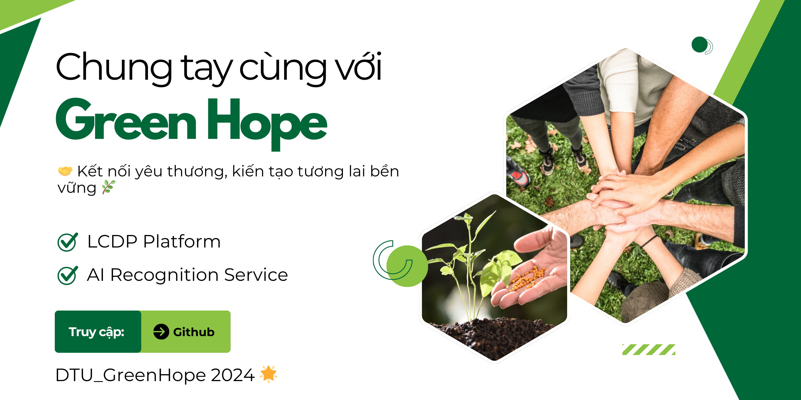

# Tổng quan

> *"🤝 Kết nối yêu thương, kiến tạo tương lai bền vững 🌿"*
Ứng dụng hỗ trợ tái thiết và đánh giá thiệt hại sau thảm họa.

Mục tiêu của dự án  là phát triển một hệ thống dựa trên nền tảng LCDP ứng dụng công nghệ trí tuệ nhân tạo để hỗ trợ tìm kiếm người mất tích, đánh giá thiệt hại và quản lý tái thiết sau thảm họa.

Dự án được thực hiện trong cuộc thi [ Phần Mềm Nguồn Mở-Olympic Tin học Sinh viên Việt Nam 2024](https://www.olp.vn/procon-pmmn/ph%E1%BA%A7n-m%E1%BB%81m-ngu%E1%BB%93n-m%E1%BB%9F)
. Được open source theo giấy phép GNU General Public [License](https://github.com/olp-dtu-2024/DTU-GreenHope/blob/main/LICENCE)  v3.0 bởi đội tác giả DTU_DZ.

`GreenHope` Là hệ thống "tái thiết và Đánh giá Hậu quả thảm họa sử dụng Công nghệ AI" là một ứng dụng tiên tiến được phát triển nhằm hỗ trợ cứu nạn và tái thiết sau thảm họa. Hệ thống tích hợp công nghệ drone và bản đồ vệ tinh để tìm kiếm và cứu nạn, giúp xác định vị trí những người mất tích trong các khu vực bị ảnh hưởng. Đặc biệt, công nghệ AI sẽ phân tích hình ảnh từ drone hoặc vệ tinh để đánh giá thiệt hại và cung cấp các báo cáo chi tiết. Bên cạnh đó, nền tảng này còn hỗ trợ tái thiết cơ sở hạ tầng sau thảm họa, kết nối cộng đồng và các tổ chức tài trợ, giám sát tiến độ và quản lý quá trình tái thiết, từ đó tạo ra những giải pháp hiệu quả cho công tác cứu trợ và phục hồi.
Mục đích của dự án là phát triển một hệ thống dựa trên nền tảng LCDP ứng dụng công nghệ trí tuệ nhân tạo để hỗ trợ tìm kiếm người mất tích, đánh giá thiệt hại và quản lý tái thiết sau thảm họa.

## 🎯 Mục tiêu 
- **Cứu nạn nhanh chóng**: Hệ thống giúp xác định nhanh chóng vị trí của những người mất tích hoặc bị mắc kẹt trong các khu vực thảm họa nhờ vào drone và bản đồ vệ tinh, hỗ trợ cứu nạn và giảm thiểu tổn thất.

- **Quản lý và theo dõi tái thiết**: Ứng dụng tạo điều kiện cho cộng đồng giám sát tiến độ tái thiết cơ sở hạ tầng, từ đó giúp các tổ chức và chính quyền địa phương đưa ra các biện pháp khắc phục kịp thời và hiệu quả.

- **Kết nối tài trợ và hỗ trợ vật chất**: Nền tảng kết nối cộng đồng với các tổ chức cứu trợ và nhà tài trợ, giúp cung cấp nguồn lực cho công tác tái thiết, đồng thời theo dõi các hoạt động hỗ trợ để đảm bảo tính minh bạch và hiệu quả.

- **Tăng cường khả năng ứng phó**: Cộng đồng sẽ có công cụ đánh giá thiệt hại chính xác và nhanh chóng, từ đó đưa ra các quyết định chính sách và hỗ trợ hợp lý, giúp tái thiết nhanh chóng và ổn định.
- **Tăng cường khả năng phối hợp và minh bạch** : Tạo ra một môi trường làm việc hiệu quả và minh bạch, từ đó nâng cao sự tin tưởng giữa các bên tham gia, giúp các bên liên quan dễ dàng phối hợp, theo dõi và giám sát công tác cứu nạn và tái thiết.
- **Tạo ra hệ thống giám sát và đánh giá hiệu quả công tác tái thiết** :  Phát triển một công cụ giám sát để theo dõi tiến độ và kết quả của quá trình tái thiết, giúp điều chỉnh chiến lược tái thiết nếu cần thiết.

## 📂 Chức Năng Chính
- ❤️‍🩹 Hỗ trợ tìm kiếm và cứu nạn 
- 🫶 Nền tảng hỗ trợ tái thiết sau thảm họa
- 🌪️ Đánh giá thiệt hại sau thảm họa

## 📢 Đối tượng hướng đến
- **Nhà tài trợ và tổ chức quốc tế**: Các tổ chức phi chính phủ, nhà tài trợ và các tổ chức quốc tế đóng vai trò quan trọng trong việc cung cấp nguồn lực cho công tác cứu trợ. Họ sẽ sử dụng nền tảng để theo dõi và giám sát các hoạt động tái thiết, đồng thời đảm bảo rằng nguồn lực được phân phối đúng nơi cần thiết.

- **Cộng đồng bị ảnh hưởng bởi thảm họa** : Các cá nhân và cộng đồng trực tiếp chịu ảnh hưởng từ thảm họa sẽ có thể nhận được hỗ trợ thông qua nền tảng. Hệ thống cung cấp thông tin về các hoạt động cứu trợ, tái thiết và giúp kết nối với các tổ chức cung cấp nguồn lực.

- **Các tổ chức, công ty cung cấp dịch vụ cứu nạn**: Các công ty cung cấp dịch vụ cứu hộ, y tế, vật tư, và tái thiết cơ sở hạ tầng sẽ sử dụng hệ thống để theo dõi các yêu cầu và hỗ trợ các hoạt động cứu nạn và phục hồi. Họ có thể nhận thông tin chi tiết về khu vực bị ảnh hưởng và điều phối các nguồn lực cần thiết.

- **Các nhà nghiên cứu và chuyên gia trong lĩnh vực thảm họa và tái thiết**: Các nhà nghiên cứu, chuyên gia trong lĩnh vực thiên tai, cứu trợ và tái thiết sẽ sử dụng ứng dụng để thu thập dữ liệu, phân tích xu hướng thiệt hại và cải tiến các chiến lược phục hồi cho các thảm họa trong tương lai.

Các tổ chức cung cấp công nghệ và giải pháp phần mềm: Các công ty công nghệ, đặc biệt trong các lĩnh vực drone, vệ tinh và AI, sẽ sử dụng nền tảng để cung cấp các giải pháp công nghệ và cải thiện hiệu quả ứng dụng của các công nghệ này trong công tác cứu trợ và tái thiết.

## 💡Nhà phát triển
- ### Lê Minh Tuấn
    -  📧 Email: minhtuanledng@gmail.com
    -  📱 Hotline: 0889001505

- ### Trần Nguyễn Duy Khánh
    -  📧 Email: duykhanhtran17062003@gmail.com
    -  📱 Hotline: 0905081330

- ### Trịnh Minh Son
    -  📧 Email: trinhminhson2004@gmail.com
    -  📱 Hotline: 0357572879

### 📝 License
Dự án này được cấp phép theo các điều khoản của giấy phép [GPL V3 License](https://github.com/olp-dtu-2024/DTU-GreenHope/blob/main/LICENCE)

