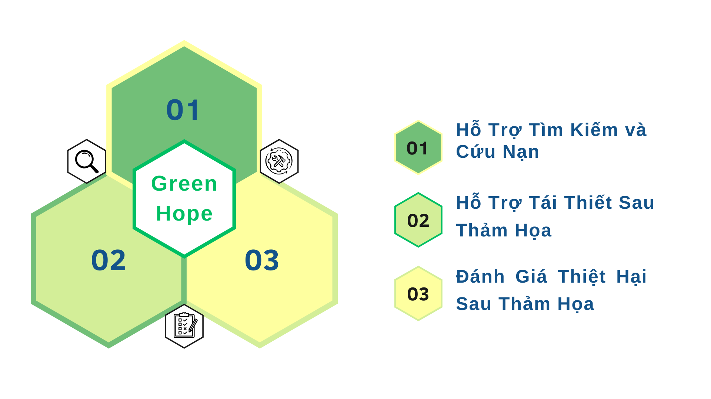

# Giới thiệu về dự án 🚀


> *"🤝 Kết nối yêu thương, kiến tạo tương lai bền vững 🌿"*

Dự án được thực hiện trong cuộc thi [ Phần Mềm Nguồn Mở-Olympic Tin học Sinh viên Việt Nam 2024](https://www.olp.vn/procon-pmmn/ph%E1%BA%A7n-m%E1%BB%81m-ngu%E1%BB%93n-m%E1%BB%9F)
. Được open source theo giấy phép [GNU General Public License](https://github.com/olp-dtu-2024/DTU-GreenHope/blob/main/LICENCE)  v3.0 bởi đội tác giả DTU_DZ.

**`GreenHope`** Là hệ thống "tái thiết và Đánh giá Hậu quả thảm họa sử dụng Công nghệ AI" là một ứng dụng tiên tiến được phát triển nhằm hỗ trợ cứu nạn và tái thiết sau thảm họa. Mục đích của dự án là phát triển một hệ thống dựa trên `nền tảng LCDP` để hỗ trợ tìm kiếm người mất tích, đánh giá thiệt hại và quản lý tái thiết sau thảm họa.

## 🔄 Tình trạng 
Mỗi khi thảm họa xảy ra, niềm mong mỏi lớn nhất của chúng ta là nhanh chóng tìm được những người đang gặp nguy hiểm và đưa họ ra khỏi tình huống khẩn cấp. Tuy nhiên, trong những tình huống này, việc tìm kiếm và cứu hộ lại không hề dễ dàng. Đặc biệt, trong những khu vực bị ảnh hưởng nặng nề, khi các con đường bị tắc nghẽn hoặc thậm chí bị phá hủy, việc xác định chính xác vị trí của những người bị kẹt trở thành một thử thách lớn. Cứu hộ trong những hoàn cảnh này cần phải nhanh chóng, chính xác và hiệu quả hơn bao giờ hết.

## 💡 Giải pháp đưa ra 
`GreenHope` Là hệ thống hỗ trợ "tái thiết và đánh giá hậu quả thảm họa sử dụng công nghệ " là một ứng dụng tiên tiến được phát triển nhằm hỗ trợ cứu nạn và tái thiết sau thảm họa. Bên cạnh đó, hệ thống này còn hỗ trợ tái thiết cơ sở hạ tầng sau thảm họa, kết nối cộng đồng và các tổ chức tài trợ, giám sát tiến độ và quản lý quá trình tái thiết, từ đó tạo ra những giải pháp hiệu quả cho công tác cứu trợ và phục hồi. Với hệ thống này, chúng ta có thể nhanh chóng giúp đỡ những người gặp nạn, giảm thiểu thiệt hại và tạo ra một môi trường an toàn hơn cho cộng đồng.

## 🎯 Mục tiêu 
- **Cứu nạn kịp thời**: Hệ thống hỗ trợ xác định nhanh chóng vị trí của những người mất tích trong khu vực thảm họa thông qua drone và bản đồ vệ tinh, góp phần cứu nạn hiệu quả và giảm thiểu tổn thất.

- **Quản lý và theo dõi tiến độ tái thiết**: Ứng dụng giúp cộng đồng theo dõi và giám sát tiến trình tái thiết cơ sở hạ tầng, từ đó hỗ trợ các tổ chức và chính quyền địa phương đưa ra những giải pháp kịp thời và hiệu quả.

- **Kết nối tài trợ và hỗ trợ vật chất**: Nền tảng giúp kết nối cộng đồng với các tổ chức cứu trợ và nhà tài trợ, tạo ra nguồn lực thiết yếu cho công tác tái thiết và đảm bảo tính minh bạch trong các hoạt động hỗ trợ.

- **Tăng cường khả năng ứng phó**: Công cụ giúp cộng đồng đánh giá thiệt hại một cách chính xác và nhanh chóng, từ đó hỗ trợ đưa ra các quyết định chính sách hợp lý và kịp thời, thúc đẩy quá trình tái thiết ổn định.

- **Nâng cao khả năng phối hợp và minh bạch** : Tạo dựng môi trường làm việc hiệu quả, minh bạch, qua đó tăng cường sự tin tưởng giữa các bên tham gia, giúp mọi người phối hợp, giám sát và theo dõi công tác cứu nạn và tái thiết một cách thuận lợi.

- **Tạo ra hệ thống giám sát và đánh giá hiệu quả công tác tái thiết** : Xây dựng công cụ giám sát để theo dõi tiến độ và kết quả của quá trình tái thiết, giúp điều chỉnh chiến lược tái thiết khi cần thiết nhằm đảm bảo sự thành công lâu dài.

- **Tăng cường khả năng cảnh báo sớm**: Hệ thống cung cấp thông tin kịp thời về các nguy cơ thiên tai, giúp cộng đồng và các cơ quan chức năng chuẩn bị sẵn sàng ứng phó và giảm thiểu thiệt hại ngay từ những giai đoạn đầu của thảm họa.

- **Tạo sự minh bạch trong quá trình quyên góp và sử dụng quỹ**:  Mỗi người quyên góp có thể theo dõi được số tiền của họ được sử dụng như thế nào, cho những hoạt động nào, và đảm bảo rằng các khoản đóng góp không bị lạm dụng.

## 📂 Chức Năng Chính




### ❤️‍🩹 Hỗ trợ tìm kiếm và cứu nạn 
  - Định vị và đánh giá tình hình 
  - Theo dõi đội cứu hộ
  - Thông báo tình trạng khẩn cấp
###  🫶 Nền tảng hỗ trợ tái thiết sau thảm họa
  - Quản lý dự án tái thiết
  - Phục hồi và phát triển cộng đồng
###  🌪️ Đánh giá thiệt hại sau thảm họa
  - Thu thập dữ liệu sau thảm họa
  - Phân tích thiệt hại
  - Báo cáo và cảnh báo
###  💰 Hệ thống quyên góp minh bạch
  - Quyên góp trực tuyến
  - Quản lý và theo dõi quỹ
  - Công khai chi tiêu
  - Thông báo và báo cáo tài chính

## 📝 Lợi ích của dự án  
- **Giảm thiểu thiệt hại**: Hệ thống sẽ giúp giảm thiểu thiệt hại về người và tài sản khi thảm họa xảy ra. Các chiến lược phản ứng sẽ được tối ưu hóa, giúp công tác cứu trợ và sơ tán diễn ra nhanh chóng và hiệu quả.
- **Nâng cao hiệu quả quản lý thảm họa**: Việc đánh giá chính xác các hậu quả của thảm họa sẽ giúp cải thiện công tác quản lý, điều phối và phân bổ nguồn lực trong các tình huống khẩn cấp.
- **Cải thiện khả năng ứng phó nhanh chóng**: Hệ thống sẽ giúp các cơ quan cứu hộ và cộng đồng có khả năng phản ứng nhanh hơn khi có thảm họa, giảm thiểu thời gian phản ứng và tổn thất.
- **Cung cấp dữ liệu phân tích cho nghiên cứu và chính sách**: Hệ thống có thể thu thập, phân tích và cung cấp dữ liệu để các nhà nghiên cứu và các cơ quan quản lý phát triển các chính sách, chiến lược dài hạn để đối phó với các thảm họa tự nhiên và nhân tạo. Điều này cũng giúp đánh giá hiệu quả của các biện pháp đã được triển khai.
- **Tăng cường khả năng hỗ trợ tài chính cho nạn nhân** : Ứng dụng giúp hỗ trợ tài chính từ cộng đồng, các tổ chức và cá nhân để cung cấp nguồn lực cho các nạn nhân của thảm họa. Các khoản quyên góp có thể được sử dụng cho việc cứu trợ khẩn cấp, tái thiết cơ sở hạ tầng, hỗ trợ y tế, và cung cấp nhu yếu phẩm cần thiết.
- **Tạo sự minh bạch trong việc sử dụng tài trợ**: Với hệ thống quyên góp tích hợp, người đóng góp có thể theo dõi được cách thức và mục đích sử dụng khoản đóng góp của mình, giúp nâng cao tính minh bạch và sự tin tưởng trong việc vận hành quỹ cứu trợ. Điều này có thể khuyến khích nhiều người tham gia ủng hộ hơn.

## 📢 Đối tượng hướng đến

- **Nhà tài trợ và tổ chức quốc tế**:  Các tổ chức phi chính phủ, nhà tài trợ và các tổ chức quốc tế đóng vai trò thiết yếu trong việc cung cấp nguồn lực cho công tác cứu trợ. Thông qua nền tảng, họ có thể theo dõi và giám sát các hoạt động tái thiết, đảm bảo rằng nguồn lực được phân phối một cách hợp lý và hiệu quả đến những khu vực cần thiết nhất.

- **Cộng đồng bị ảnh hưởng bởi thảm họa** : Các cá nhân và cộng đồng chịu ảnh hưởng trực tiếp từ thảm họa sẽ có thể dễ dàng nhận được sự hỗ trợ thông qua nền tảng. Hệ thống cung cấp thông tin về các hoạt động cứu trợ và tái thiết, đồng thời tạo cơ hội kết nối với các tổ chức cung cấp nguồn lực thiết yếu cho quá trình phục hồi.

- **Các tổ chức, công ty cung cấp dịch vụ cứu nạn**: Các công ty chuyên cung cấp dịch vụ cứu hộ, y tế, vật tư và tái thiết cơ sở hạ tầng sẽ sử dụng hệ thống để theo dõi các yêu cầu cứu nạn và phục hồi. Họ có thể nhận thông tin chi tiết về khu vực bị ảnh hưởng và phối hợp hiệu quả trong việc điều phối các nguồn lực cần thiết.

- **Các nhà nghiên cứu và chuyên gia trong lĩnh vực thảm họa và tái thiết**: Các nhà nghiên cứu và chuyên gia trong các lĩnh vực thiên tai, cứu trợ và tái thiết sẽ tận dụng ứng dụng để thu thập dữ liệu, phân tích xu hướng thiệt hại, từ đó cải tiến các chiến lược phục hồi cho các thảm họa trong tương lai, nhằm tăng cường khả năng ứng phó và giảm thiểu thiệt hại.

- **Các tổ chức cung cấp công nghệ và giải pháp phần mềm**: Các công ty công nghệ, đặc biệt trong các lĩnh vực drone, vệ tinh và AI, sẽ sử dụng nền tảng để cung cấp các giải pháp công nghệ và cải thiện hiệu quả ứng dụng của các công nghệ này trong công tác cứu trợ và tái thiết.


## 💡Nhà phát triển
-  Lê Minh Tuấn
```
      📧 Email: minhtuanledng@gmail.com
      📱 Hotline: 0889001505
```
-  Trần Nguyễn Duy Khánh
```
     📧 Email: duykhanhtran17062003@gmail.com
     📱 Hotline: 0905081330
```
-  Trịnh Minh Son
```
     📧 Email: trinhminhson2004@gmail.com
     📱 Hotline: 0357572879
```
### 📝 License
Dự án này được cấp phép theo các điều khoản của giấy phép GPL V3 [GPL V3 License](https://github.com/olp-dtu-2024/DTU-GreenHope/blob/main/LICENSE)
