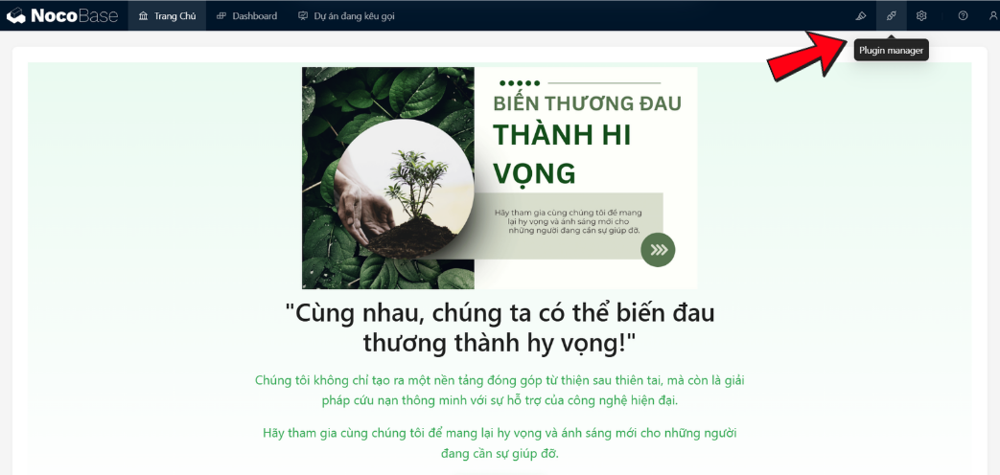
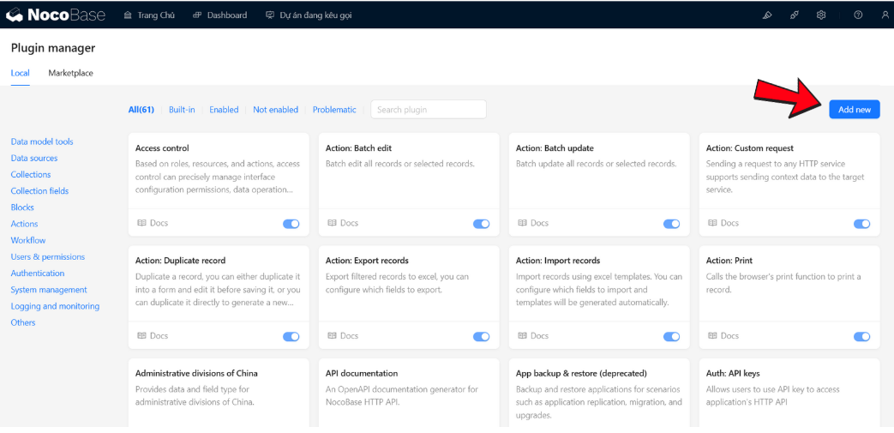
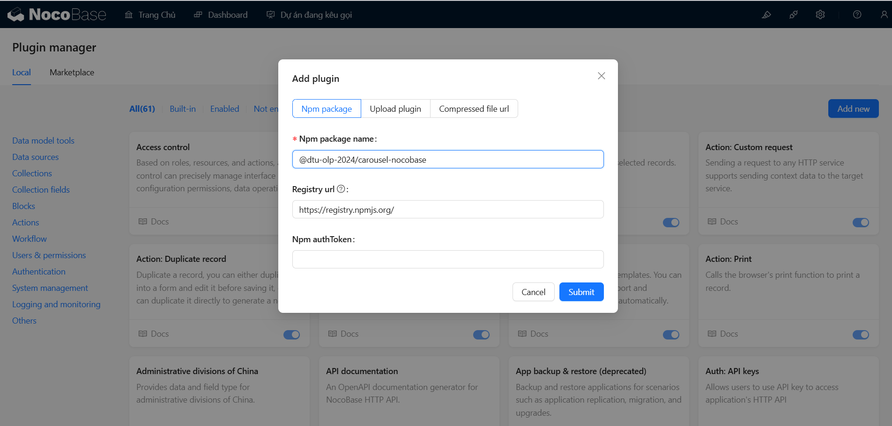
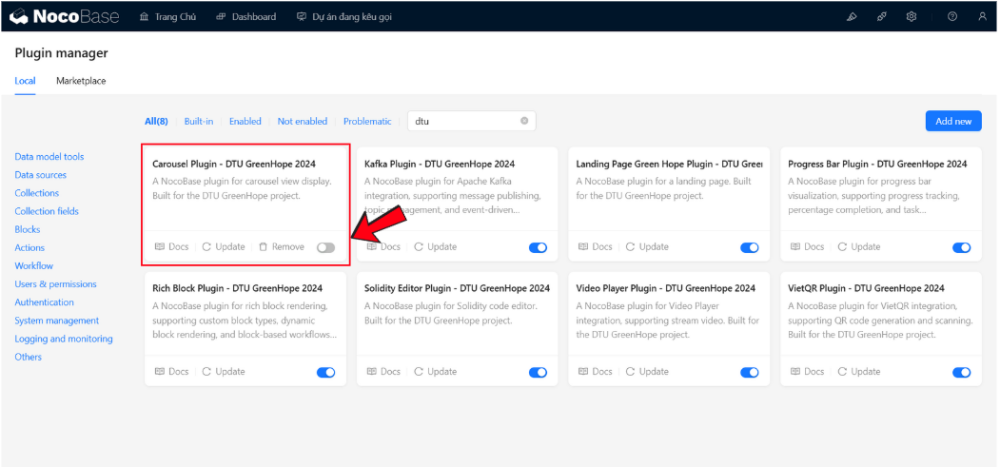
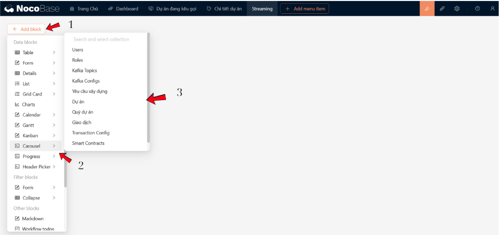
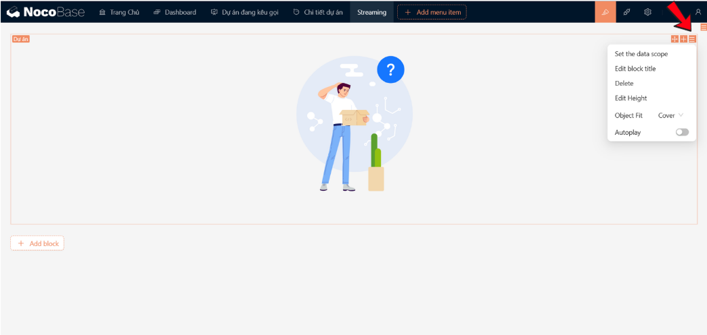
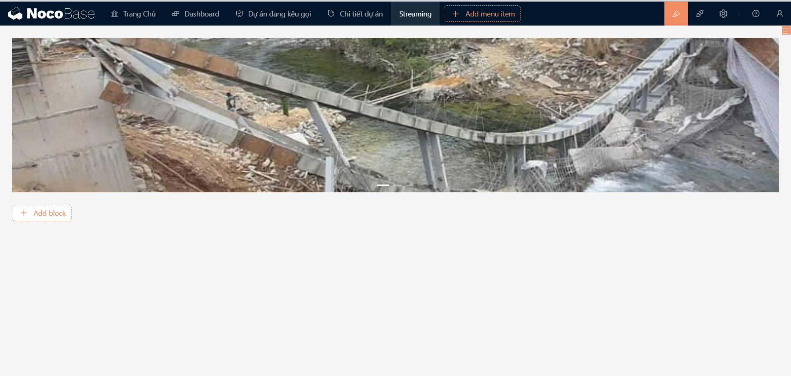

# Carousel NocoBase Plugin
## 🌟 Giới Thiệu
_**[@dtu-olp-2024/carousel-nocobase](https://www.npmjs.com/package/@dtu-olp-2024/carousel-nocobase)**_ là một plugin cho nền tảng NocoBase, cung cấp trải nghiệm hiển thị hình ảnh linh hoạt với Carousel dựa trên Ant Design (antd). Plugin giúp người dùng dễ dàng tạo và quản lý các slide show một cách trực quan và nhanh chóng.
### 🏆 Bối Cảnh
Plugin được phát triển như một phần của cuộc thi **Mã Nguồn Mở năm 2024**.


## ✨ Tính Năng
- 🖼️ Tích hợp dễ dàng Ant Design Carousel với NocoBase
- 🔀 Hỗ trợ hiển thị hình ảnh từ các nguồn dữ liệu khác nhau
- 🔧 Quản lý và tùy chỉnh carousel hiệu quả
- 🔗 Tương thích với phiên bản NocoBase 1.x

## 🚀 **Cài Đặt**

### 🔧 **Sử dụng yarn:**
```bash 
    yarn add @olp-dtu-2024/carousel-nocobase 
```

### 🛠️ **Thêm trực tiếp với plugin manager:**

Từ trên menu, bạn chọn biểu tượng **Plugin manager** để truy cập vào Plugin manager

 

Tiếp theo, bạn ấn nút **`Add new`** để mở hộp thoại thêm plugin.



  ✏️ **Sử dụng tên plugin**: 
  - Nhập tên plugin _**[@dtu-olp-2024/carousel-nocobase](https://www.npmjs.com/package/@dtu-olp-2024/carousel-nocobase)**_ vào ô nhập **`Npm package name`**.



  ✅ **Kích hoạt plugin**:

Sau khi thêm plugin thành công, bạn phải **`enable`** plugin này để sử dụng:


## 💡 **Hướng dẫn sử dụng**
### 1️⃣ **Tạo khối:**



Lần lượt các bước thực hiện như sau: 
  - **Bước 1**: Chọn nút **_`Add Block`_** để mở hộp thoại chọn khối.
  - **Bước 2**: Chọn khối **_`Carousel`_**.
  - **Bước 3**: Chọn khối dữ liệu (_hay `collection`_) chứa ảnh mà bạn muốn hiển thị.


### 2️⃣ **Tuỳ chỉnh giới hạn dữ liệu:**

Chọn lựa chọn **`Settings`** mở ra các tuỳ chỉnh có thể sử dụng



Tiếp theo, bạn lựa chọn **`Set the data scope`** để mở hộp thoại tạo giới hạn dữ liệu để lấy ra hình ảnh.

Ví dụ: Chúng ta có một _`params`_ trên URL là `id`


  - **Bước 1**: Chọn thuộc tính cần đặt giới hạn. Ví dụ **_`ID`_**.
  - **Bước 2**: Chọn phép so sánh, sau đó chọn nút _`x`_ để mở hộp thoại chọn giá trị.
  - **Bước 3**: Chọn giá trị cần so sánh.



  ⚙️ _**Các tuỳ chỉnh khác**:_
    -  **Edit block title**: Thêm tiêu đề cho carousel.
    -  **Delete**: Xoá bỏ.
    -  **Edit Height**: Điều chỉnh chiều cao cho carousel.
    -  **Object Fit**: Thay đổi độ phủ của hình ảnh.
    -  **Auto Play**: Điều chỉnh carousel tự chuyển động hoặc không.

## 📋 Yêu Cầu Tiên Quyết
- Node.js version 18.x trở lên
- NocoBase version mới nhất
- Ant Design phiên bản 4.x trở lên
## 👥 Tác Giả
- Lê Minh Tuấn
- Trần Nguyễn Duy Khánh
- Trịnh Minh Son


## 📄 Giấy Phép
Dự án được phân phối dưới giấy phép [GNU General Public License v3.0 ](https://github.com/olp-dtu-2024/DTU-GreenHope/blob/main/LICENCE)

## 🤝 Đóng Góp
Chúng tôi rất hoan nghênh các đóng góp từ cộng đồng! Vui lòng:

- Tạo issue để báo cáo lỗi
- Gửi pull request để đề xuất cải tiến
- Truy cập GitHub Repository của chúng tôi để biết thêm chi tiết

## 🆘 Hỗ Trợ
Nếu gặp bất kỳ vấn đề nào, vui lòng:

- Mở issue tại GitHub repository
- Liên hệ trực tiếp với nhóm phát triển
## ⚠️ Lưu Ý
- Đảm bảo tương thích với phiên bản NocoBase hiện tại
- Kiểm tra kết nối và cấu hình trước khi sử dụng


*"Được phát triển với ❤️ bởi Nhóm DTU_DZ1 🌟"*
