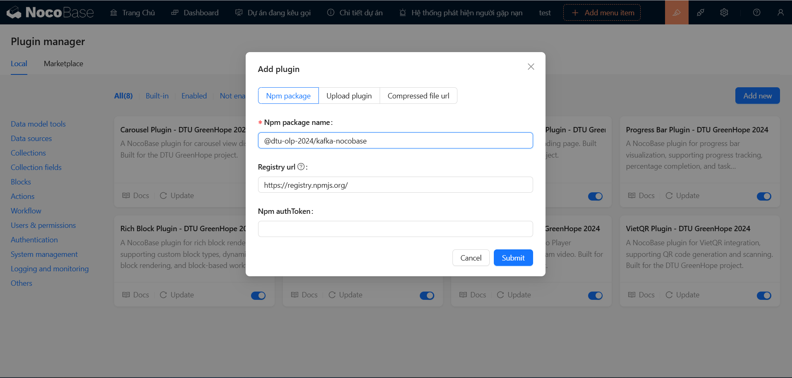

# Kafka NocoBase Plugin

## 🌟 Giới Thiệu
_**[@dtu-olp-2024/kafka-nocobase](https://www.npmjs.com/package/@dtu-olp-2024/kafka-nocobase)**_ là một plugin mạnh mẽ dành cho nền tảng NocoBase, tích hợp **KafkaJS** giúp đơn giản hóa việc xử lý các sự kiện và giao tiếp message trong ứng dụng NocoBase của bạn. Với plugin này, bạn có thể dễ dàng gửi, nhận và quản lý message từ các Kafka topic.

### 🏆 Bối Cảnh
Plugin được phát triển như một phần của cuộc thi **Mã Nguồn Mở 2024** với mục tiêu nâng cao khả năng giao tiếp và xử lý sự kiện giữa các **Microservice** trong các ứng dụng NocoBase. Chúng tôi hy vọng dự án này sẽ giúp cộng đồng mở rộng khả năng tương tác và tận dụng sức mạnh của Kafka trong các hệ thống phân tán.

## ✨ Tính Năng
- 🔗 **Tích hợp dễ dàng KafkaJS với NocoBase**: Plugin này giúp bạn dễ dàng kết nối Kafka với nền tảng NocoBase mà không cần cấu hình phức tạp.
- 📩 **Hỗ trợ gửi và nhận message từ các Kafka topic**: Bạn có thể gửi và nhận message trực tiếp từ các topic của Kafka, giúp quá trình giao tiếp giữa các hệ thống trở nên dễ dàng hơn bao giờ hết.
- 🔧 **Quản lý kết nối Kafka hiệu quả**: Tối ưu hóa việc quản lý các kết nối Kafka, giúp việc xử lý dữ liệu diễn ra nhanh chóng và ổn định.
- 🌐 **Tương thích với phiên bản NocoBase 1.x**: Đảm bảo plugin hoạt động mượt mà trên phiên bản mới nhất của NocoBase.

## 🚀 **Cài Đặt**

### 🔧 **Sử dụng yarn:**
```bash 
    yarn add @olp-dtu-2024/kafka-nocobase 
```

### 🛠️ **Thêm trực tiếp với plugin manager:**

Từ trên menu, bạn chọn biểu tượng **Plugin manager** để truy cập vào Plugin manager

 

Tiếp theo, bạn ấn nút **`Add new`** để mở hộp thoại thêm plugin.


  ✏️ **Sử dụng tên plugin**: 
  - Nhập tên plugin _**[@dtu-olp-2024/kafka-nocobase](https://www.npmjs.com/package/@dtu-olp-2024/kafka-nocobase)**_ vào ô nhập **`Npm package name`**.




  ✅ **Kích hoạt plugin**:

Sau khi thêm plugin thành công, bạn phải **`enable`** plugin này để sử dụng:


## 🚀 **Phương pháp áp dụng**

### 1️⃣ Xử lý Event

- Plugin sẽ tự động gửi message đến các topic được cấu hình
- Message có thể chứa các thông tin như:
  - ID của đối tượng cần xử lý
  - Dữ liệu cần được truyền tải
  - Timestamp và metadata khác

### 2️⃣ Error Handling

- Tích hợp hệ thống xử lý lỗi tự động
- Cung cấp các status code phù hợp cho từng loại lỗi
- Hệ thống logging chi tiết để theo dõi và debug

## ⚠️ Lưu ý

- Đảm bảo môi trường Kafka được cấu hình đúng cách
- Kiểm tra kết nối giữa các service và Kafka broker
- Theo dõi logs thường xuyên để đảm bảo hệ thống hoạt động ổn định
- Cấu hình timeout và retry policy phù hợp với yêu cầu hệ thống

## Yêu cầu hệ thống

- NocoBase server
- Kafka broker đang chạy
- Kết nối mạng ổn định giữa các service

## 📋 Yêu Cầu Tiên Quyết
Để sử dụng plugin này, bạn cần đảm bảo một số yêu cầu cơ bản:
- **Node.js** version 18.x trở lên 🚀
- **NocoBase** phiên bản mới nhất 🌍
- **KafkaJS** version 2.2.4 trở lên 🧑‍💻
## 👥 Tác Giả
- Lê Minh Tuấn
- Trần Nguyễn Duy Khánh
- Trịnh Minh Son

## 📄 Giấy Phép
Dự án được phân phối dưới giấy phép [GNU General Public License v3.0 ](https://github.com/olp-dtu-2024/DTU-GreenHope/blob/main/LICENCE)
## 🤝 Đóng Góp
Chúng tôi rất hoan nghênh các đóng góp từ cộng đồng! Hãy tham gia và giúp dự án này ngày càng hoàn thiện hơn. Các bước đóng góp của bạn:

- 📝 **Tạo issue** để báo cáo lỗi hoặc yêu cầu tính năng mới
- 🔄 **Gửi pull request** để đề xuất cải tiến hoặc sửa lỗi
- 📂 **Truy cập GitHub Repository** của chúng tôi để biết thêm chi tiết

## 🆘 Hỗ Trợ
Nếu gặp bất kỳ vấn đề nào khi sử dụng plugin hoặc cần trợ giúp, vui lòng liên hệ với chúng tôi:

- **Mở issue** tại GitHub repository
- **Liên hệ trực tiếp** với nhóm phát triển qua email hoặc các kênh hỗ trợ

## ⚠️ Lưu Ý
Trước khi sử dụng plugin, hãy lưu ý một số điểm quan trọng:

- ✅ **Đảm bảo tương thích** với phiên bản NocoBase hiện tại của bạn
- 🔧 **Kiểm tra kết nối và cấu hình** trước khi bắt đầu sử dụng để tránh các vấn đề phát sinh
### 📝 License
Dự án này được cấp phép theo các điều khoản của giấy phép GPL V3 [GPL V3 License](https://github.com/olp-dtu-2024/DTU-GreenHope/blob/main/LICENSE)


*"Được phát triển với ❤️ bởi Nhóm DTU_DZ1 🌟"*
