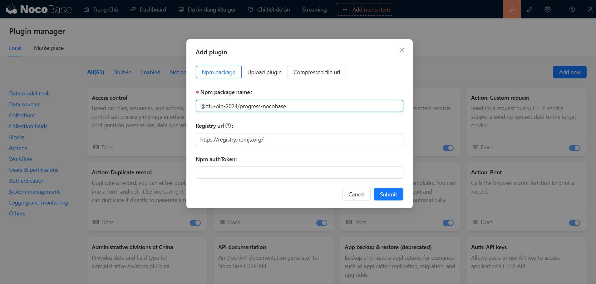
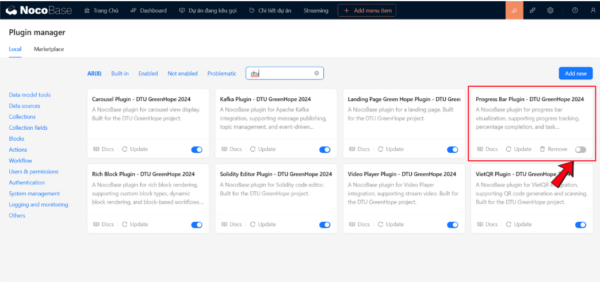
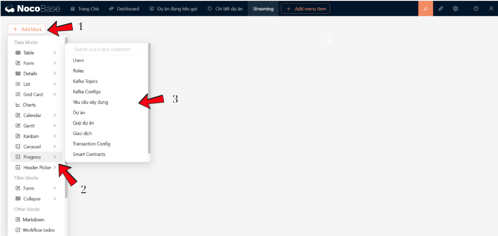
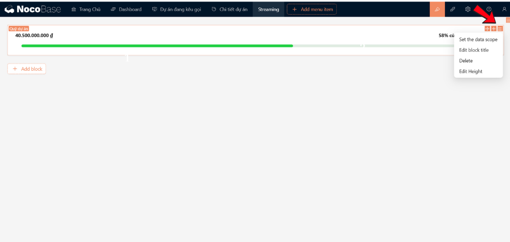
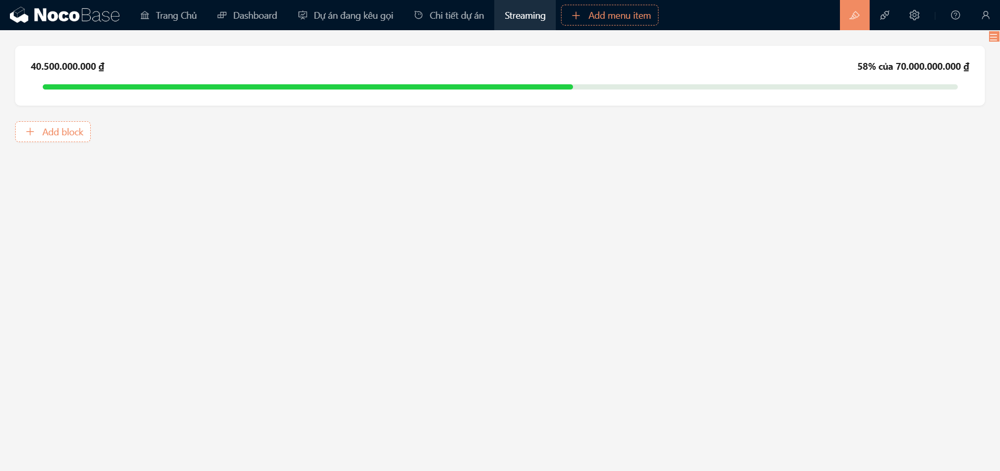

# Progress NocoBase Plugin

## 🌟 Giới Thiệu
_**[@dtu-olp-2024/progress-nocobase](https://www.npmjs.com/package/@dtu-olp-2024/progress-nocobase)**_ là một plugin dành cho nền tảng **NocoBase**, tích hợp **Progress Bar** từ **Ant Design**, giúp đơn giản hóa việc hiển thị tiến độ dưới dạng thanh tiến trình trong ứng dụng của bạn. Plugin này giúp bạn dễ dàng theo dõi và hiển thị tiến độ công việc, tải dữ liệu, hoặc bất kỳ quá trình nào trong ứng dụng NocoBase.

### 🏆 Bối Cảnh
Plugin được phát triển như một phần của cuộc thi **Mã Nguồn Mở 2024**, với mục tiêu cải thiện trải nghiệm người dùng và tối ưu hóa các giao diện hiển thị tiến độ trong các ứng dụng NocoBase.

## ✨ Tính Năng
- 🔗 **Tích hợp dễ dàng Ant Design Progress với NocoBase**: Bạn có thể nhanh chóng thêm thanh tiến trình vào ứng dụng của mình mà không cần cấu hình phức tạp.
- 🎨 **Tùy chỉnh giao diện và màu sắc thanh tiến trình**: Cho phép bạn thay đổi màu sắc và thiết kế của thanh tiến trình để phù hợp với giao diện ứng dụng của bạn.
- 🧮 **Tự động tính toán phần trăm hoàn thành**: Plugin tự động tính toán và cập nhật phần trăm hoàn thành của tiến trình, giúp bạn dễ dàng theo dõi sự phát triển của các tác vụ.
- 🌐 **Tương thích với phiên bản NocoBase 1.x**: Đảm bảo plugin hoạt động mượt mà trên nền tảng NocoBase phiên bản mới nhất.

## 🚀 Cài Đặt
Để bắt đầu sử dụng plugin Progress Bar NocoBase, bạn cần cài đặt và cấu hình plugin trong dự án NocoBase của mình.

### 🔧 **Sử dụng yarn:**
Trước tiên, cài đặt plugin vào dự án của bạn bằng cách sử dụng một trong các công cụ quản lý gói sau:

```
yarn add @olp-dtu-2024/progress-nocobase
```
📦 **Cài đặt xong, plugin đã sẵn sàng!**

### ✏️ **Sử dụng tên plugin:**
  - Nhập tên plugin _**[@dtu-olp-2024/progress-nocobase](https://www.npmjs.com/package/@dtu-olp-2024/progress-nocobase)**_ vào ô nhập **`Npm package name`**.



  ✅ **Kích hoạt plugin**:

Sau khi thêm plugin thành công, bạn phải **`enable`** plugin này để sử dụng:


## 💡 **Hướng dẫn sử dụng**
### 1️⃣ **Tạo khối:**



Lần lượt các bước thực hiện như sau: 
  - **Bước 1**: Chọn nút **_`Add Block`_** để mở hộp thoại chọn khối.
  - **Bước 2**: Chọn khối **_`Progress`_**.
  - **Bước 3**: Chọn khối dữ liệu (_hay `collection`_) chứa dữ liệu để tính tiến độ mà bạn muốn hiển thị.


### 2️⃣ **Tuỳ chỉnh giới hạn dữ liệu:**

Chọn lựa chọn **`Settings`** mở ra các tuỳ chỉnh có thể sử dụng



Tiếp theo, bạn lựa chọn **`Set the data scope`** để mở hộp thoại tạo giới hạn dữ liệu để lấy ra hình ảnh.

Ví dụ: Chúng ta có một _`params`_ trên URL là `fundId`


  - **Bước 1**: Chọn thuộc tính cần đặt giới hạn. Ví dụ **_`ID`_**.
  - **Bước 2**: Chọn phép so sánh, sau đó chọn nút _`x`_ để mở hộp thoại chọn giá trị.
  - **Bước 3**: Chọn giá trị cần so sánh.



  ⚙️ _**Các tuỳ chỉnh khác**:_
    -  **Edit block title**: Thêm tiêu đề cho Progress.
    -  **Delete**: Xoá bỏ.
    -  **Edit Height**: Điều chỉnh chiều cao cho Progress.

## 📋 Yêu Cầu Tiên Quyết
Để sử dụng plugin này, bạn cần đảm bảo một số yêu cầu cơ bản:
- **Node.js** version 18.x trở lên 🚀
- **NocoBase** phiên bản mới nhất 🌍
- **KafkaJS** version 2.2.4 trở lên 🧑‍💻
## 👥 Tác Giả
- Lê Minh Tuấn
- Trần Nguyễn Duy Khánh
- Trịnh Minh Son

## 📄 Giấy Phép
Dự án được phân phối dưới giấy phép [GNU General Public License v3.0 ](https://github.com/olp-dtu-2024/DTU-GreenHope/blob/main/LICENCE)
## 🤝 Đóng Góp
Chúng tôi rất hoan nghênh các đóng góp từ cộng đồng! Hãy tham gia và giúp dự án này ngày càng hoàn thiện hơn. Các bước đóng góp của bạn:

- 📝 **Tạo issue** để báo cáo lỗi hoặc yêu cầu tính năng mới
- 🔄 **Gửi pull request** để đề xuất cải tiến hoặc sửa lỗi
- 📂 **Truy cập GitHub Repository** của chúng tôi để biết thêm chi tiết

## 🆘 Hỗ Trợ
Nếu gặp bất kỳ vấn đề nào khi sử dụng plugin hoặc cần trợ giúp, vui lòng liên hệ với chúng tôi:

- **Mở issue** tại GitHub repository
- **Liên hệ trực tiếp** với nhóm phát triển qua email hoặc các kênh hỗ trợ

## ⚠️ Lưu Ý
Trước khi sử dụng plugin, hãy lưu ý một số điểm quan trọng:

- ✅ **Đảm bảo tương thích** với phiên bản NocoBase hiện tại của bạn
- 🔧 **Kiểm tra kết nối và cấu hình** trước khi bắt đầu sử dụng để tránh các vấn đề phát sinh


*"Được phát triển với ❤️ bởi Nhóm DTU_DZ1 🌟"*
