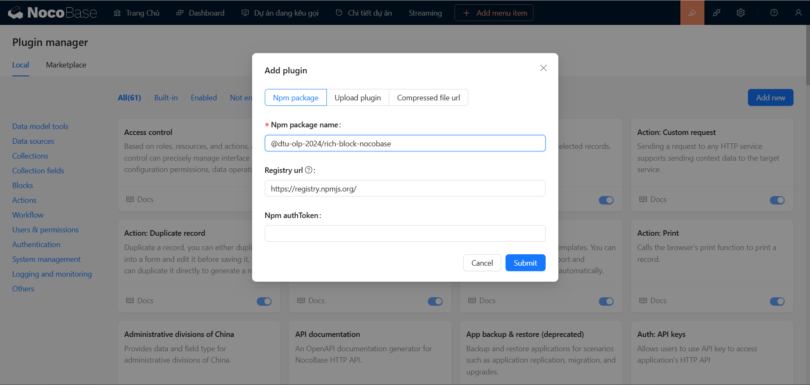
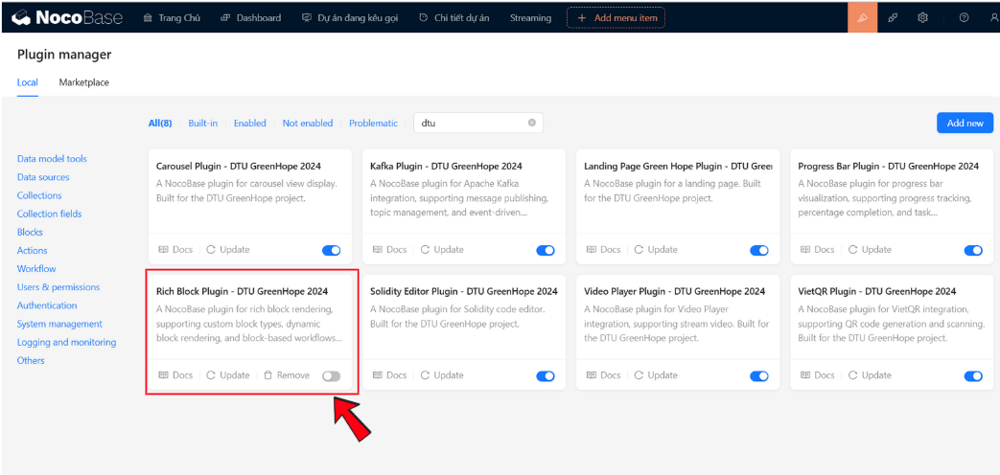
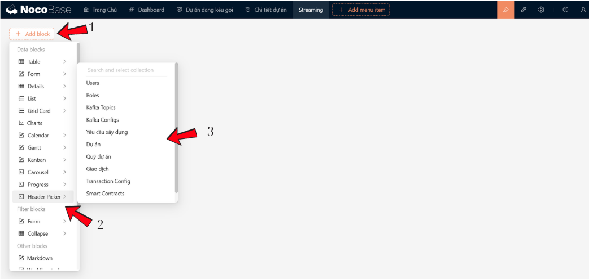
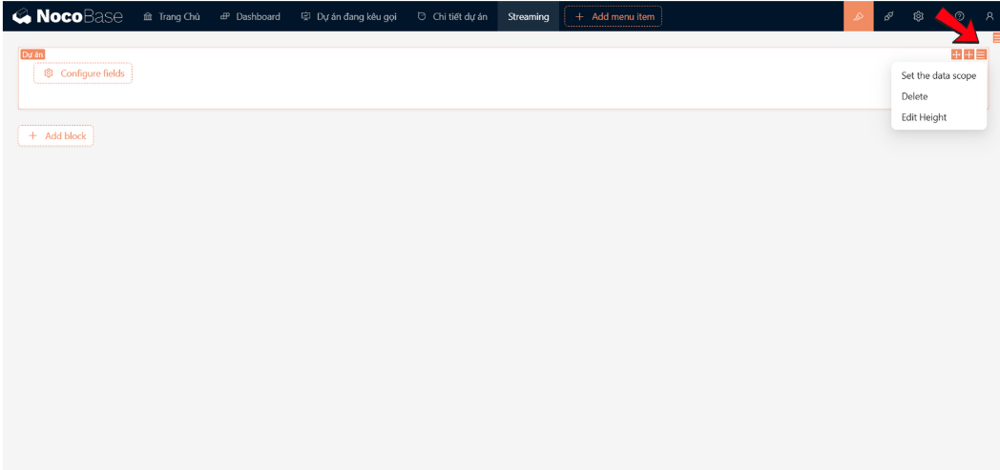
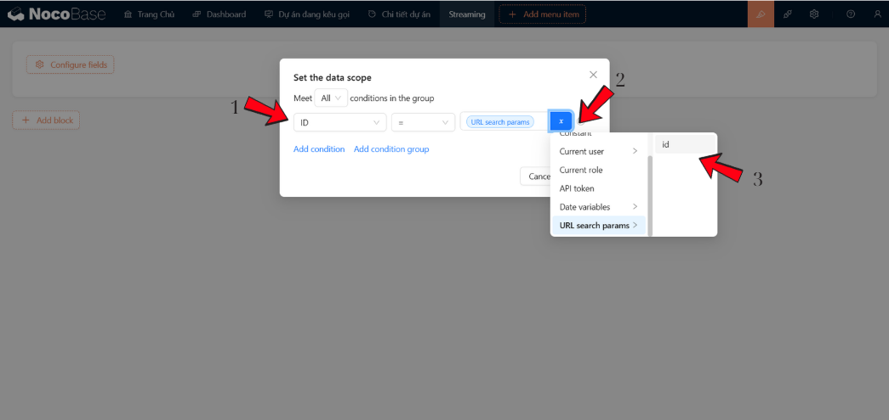
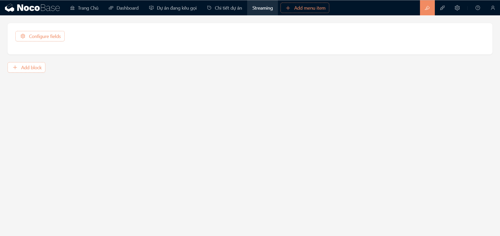
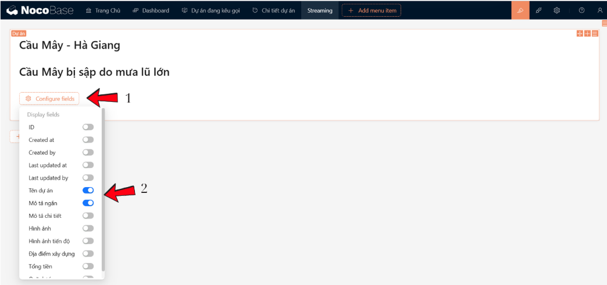
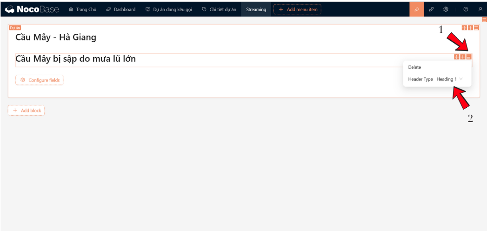
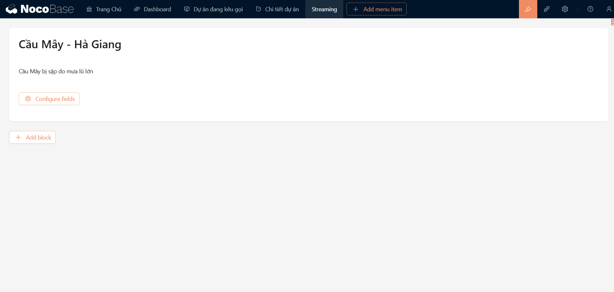

# RichBlock NocoBase Plugin

## 🌟 Giới Thiệu
_**[@dtu-olp-2024/rich-block-nocobase](https://www.npmjs.com/package/@dtu-olp-2024/rich-block-nocobase)**_ là một plugin mạnh mẽ dành cho nền tảng NocoBase, mang lại **trải nghiệm soạn thảo nội dung linh hoạt** với các khối kéo thả, tích hợp **Ant Design (antd)**. Plugin này giúp người dùng dễ dàng tạo các **content card** phức tạp với các **heading** và đoạn văn một cách trực quan và nhanh chóng. Được thiết kế để tiết kiệm thời gian và tăng hiệu quả công việc!

### 🏆 Bối Cảnh
Plugin được phát triển như một phần của cuộc thi **Mã Nguồn Mở 2024** với mục tiêu mang đến cho người dùng một công cụ mạnh mẽ để tạo và quản lý nội dung trong các ứng dụng NocoBase, sử dụng giao diện kéo thả dễ dàng và linh hoạt.

## ✨ Tính Năng
- 📝 **Hỗ trợ tạo content card với các heading từ H1 đến Paragraph**: Bạn có thể tạo ra các khối nội dung với các tiêu đề linh hoạt, từ H1 cho đến H6, phù hợp với nhu cầu cấu trúc nội dung của bạn.
- 🖱️ **Giao diện kéo thả trực quan sử dụng Ant Design**: Sử dụng giao diện kéo thả hiện đại, giúp người dùng dễ dàng di chuyển, chỉnh sửa các phần tử mà không cần viết mã.
- 🔧 **Tùy chỉnh linh hoạt các block nội dung**: Bạn có thể tùy chỉnh mỗi khối nội dung theo ý muốn, từ các heading, văn bản cho đến các kiểu bố cục khác nhau.
- 🔀 **Hỗ trợ thêm, xóa, di chuyển các block một cách dễ dàng**: Tính năng này cho phép bạn thao tác với các block nhanh chóng, giúp tối ưu hóa quy trình làm việc.
- 🔗 **Tích hợp mượt mà với NocoBase**: Plugin hoạt động hoàn hảo với NocoBase, mang lại một trải nghiệm mượt mà khi sử dụng chung với nền tảng này.

## 🚀 **Cài Đặt**

### 🔧 **Sử dụng yarn:**
```bash 
    yarn add @olp-dtu-2024/rich-block-nocobase 
```

### 🛠️ **Thêm trực tiếp với plugin manager:**

Từ trên menu, bạn chọn biểu tượng **Plugin manager** để truy cập vào Plugin manager

 

Tiếp theo, bạn ấn nút **`Add new`** để mở hộp thoại thêm plugin.


  ✏️ **Sử dụng tên plugin**: 
  - Nhập tên plugin _**[@dtu-olp-2024/rich-block-nocobase](https://www.npmjs.com/package/@dtu-olp-2024/rich-block-nocobase)**_ vào ô nhập **`Npm package name`**.



  ✅ **Kích hoạt plugin**:

Sau khi thêm plugin thành công, bạn phải **`enable`** plugin này để sử dụng:


## 💡 **Hướng dẫn sử dụng**
### 1️⃣ **Tạo khối:**



Lần lượt các bước thực hiện như sau: 
  - **Bước 1**: Chọn nút **_`Add Block`_** để mở hộp thoại chọn khối.
  - **Bước 2**: Chọn khối **_`Rich Block`_**.
  - **Bước 3**: Chọn khối dữ liệu (_hay `collection`_) chứa các text mà bạn muốn hiển thị.


### 2️⃣ **Tuỳ chỉnh giới hạn dữ liệu:**

Chọn lựa chọn **`Settings`** mở ra các tuỳ chỉnh có thể sử dụng



Tiếp theo, bạn lựa chọn **`Set the data scope`** để mở hộp thoại tạo giới hạn dữ liệu để lấy ra các text cần hiển thị.

Ví dụ: Chúng ta có một _`params`_ trên URL là `id`



  - **Bước 1**: Chọn thuộc tính cần đặt giới hạn. Ví dụ **_`ID`_**.
  - **Bước 2**: Chọn phép so sánh, sau đó chọn nút _`x`_ để mở hộp thoại chọn giá trị.
  - **Bước 3**: Chọn giá trị cần so sánh.



  ⚙️ _**Các tuỳ chỉnh khác**:_
    -  **Edit block title**: Thêm tiêu đề cho Rich Block.
    -  **Delete**: Xoá bỏ.
    -  **Edit Height**: Điều chỉnh chiều cao cho Rich Block.
    -  **Object Fit**: Thay đổi độ phủ của hình ảnh.
    -  **Auto Play**: Điều chỉnh Rich Block tự chuyển động hoặc không.

### 3️⃣ **Chọn và hiển thị các nội dung:**


    -  **Bước 1**: Chọn _`Configure fields`_ mở hộp thoại chọn nội dung hiển thị.
    -  **Bước 2**: Điều chỉnh Rich Block tự chuyển động hoặc không.

### 4️⃣ **Thay đổi các loại thẻ heading:**


    -  **Bước 1**: Chọn nút _`Setting`_ mở hộp thoại chọn tuỳ chỉnh.
    -  **Bước 2**: Thay đổi các kiểu heading mong muốn.



## 📋 Yêu Cầu Tiên Quyết
Để sử dụng plugin này, bạn cần đảm bảo một số yêu cầu cơ bản:
- **Node.js** version 18.x trở lên 🚀
- **NocoBase** phiên bản mới nhất 🌍
- **KafkaJS** version 2.2.4 trở lên 🧑‍💻
## 👥 Tác Giả
- Lê Minh Tuấn
- Trần Nguyễn Duy Khánh
- Trịnh Minh Son

## 📄 Giấy Phép
Dự án được phân phối dưới giấy phép [GNU General Public License v3.0 ](https://github.com/olp-dtu-2024/DTU-GreenHope/blob/main/LICENCE)
## 🤝 Đóng Góp
Chúng tôi rất hoan nghênh các đóng góp từ cộng đồng! Hãy tham gia và giúp dự án này ngày càng hoàn thiện hơn. Các bước đóng góp của bạn:

- 📝 **Tạo issue** để báo cáo lỗi hoặc yêu cầu tính năng mới
- 🔄 **Gửi pull request** để đề xuất cải tiến hoặc sửa lỗi
- 📂 **Truy cập GitHub Repository** của chúng tôi để biết thêm chi tiết

## 🆘 Hỗ Trợ
Nếu gặp bất kỳ vấn đề nào khi sử dụng plugin hoặc cần trợ giúp, vui lòng liên hệ với chúng tôi:

- **Mở issue** tại GitHub repository
- **Liên hệ trực tiếp** với nhóm phát triển qua email hoặc các kênh hỗ trợ

## ⚠️ Lưu Ý
Trước khi sử dụng plugin, hãy lưu ý một số điểm quan trọng:

- ✅ **Đảm bảo tương thích** với phiên bản NocoBase hiện tại của bạn
- 🔧 **Kiểm tra kết nối và cấu hình** trước khi bắt đầu sử dụng để tránh các vấn đề phát sinh


*"Được phát triển với ❤️ bởi Nhóm DTU_DZ1 🌟"*
