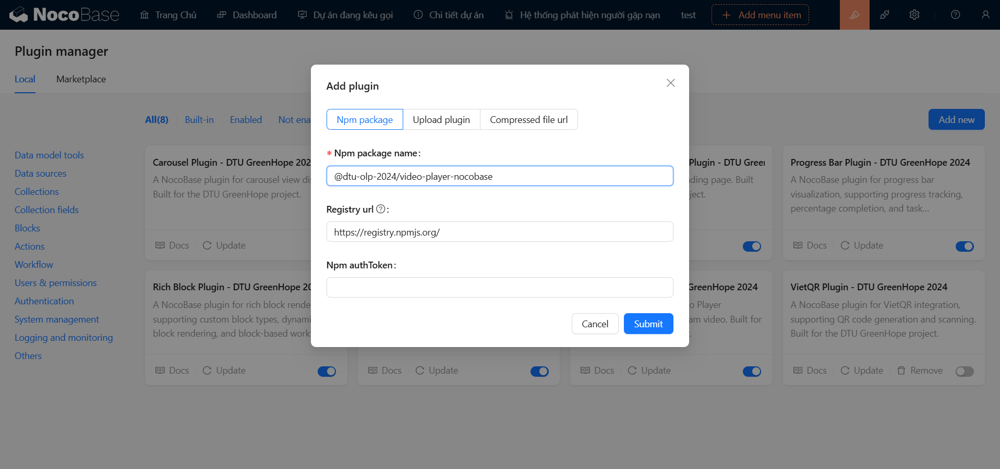
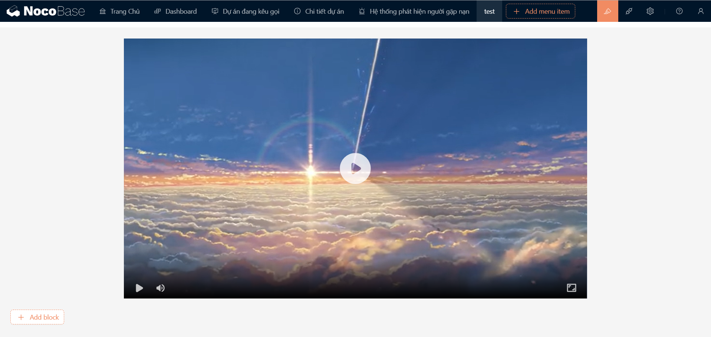
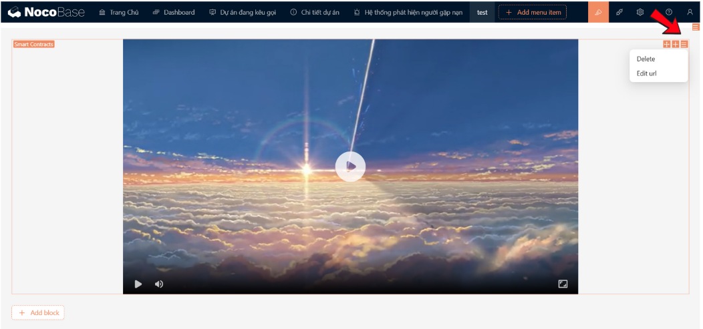

# Video Player NocoBase Plugin

## 🌟 Giới Thiệu

_**[@dtu-olp-2024/video-player-nocobase](https://www.npmjs.com/package/@dtu-olp-2024/video-player-nocobase)**_ là một **Plugin mạnh mẽ** cung cấp trình phát video tích hợp với nhiều tính năng nâng cao, hỗ trợ đa nền tảng và định dạng video khác nhau. Với plugin này, bạn có thể dễ dàng phát các video trong ứng dụng NocoBase của mình, đồng thời tận hưởng trải nghiệm người dùng mượt mà và tùy chỉnh linh hoạt.

### 🏆 Bối Cảnh

Plugin được phát triển như một phần của cuộc thi **Mã Nguồn Mở 2024**. Mục tiêu của dự án này là mang lại giải pháp phát video dễ sử dụng và hiệu quả, giúp nâng cao trải nghiệm người dùng trong các ứng dụng xây dựng trên nền tảng NocoBase.

## ✨ Tính Năng

- 🎥 **Trình phát video đa nền tảng**: Plugin này cho phép phát video trên nhiều nền tảng khác nhau, đảm bảo tính linh hoạt và tương thích với hầu hết các thiết bị và trình duyệt.
- 🔧 **Hỗ trợ nhiều định dạng video**: Bạn có thể phát video với nhiều định dạng phổ biến như MP4, WebM, và OGG mà không gặp bất kỳ vấn đề nào.
- 🔌 **Tích hợp mượt mà với NocoBase**: Plugin dễ dàng tích hợp vào bất kỳ ứng dụng NocoBase nào, cho phép bạn phát video trực tiếp từ các nguồn khác nhau mà không cần cấu hình phức tạp.

## 🚀 **Cài Đặt**

### 🔧 **Sử dụng yarn:**
```bash 
    yarn add @olp-dtu-2024/video-player-nocobase 
```

### 🛠️ **Thêm trực tiếp với plugin manager:**

Từ trên menu, bạn chọn biểu tượng **Plugin manager** để truy cập vào Plugin manager

 

Tiếp theo, bạn ấn nút **`Add new`** để mở hộp thoại thêm plugin.


  ✏️ **Sử dụng tên plugin**: 
  - Nhập tên plugin _**[@dtu-olp-2024/video-player-nocobase](https://www.npmjs.com/package/@dtu-olp-2024/video-player-nocobase)**_ vào ô nhập **`Npm package name`**.



  ✅ **Kích hoạt plugin**:

Sau khi thêm plugin thành công, bạn phải **`enable`** plugin này để sử dụng:


## 💡 **Hướng dẫn sử dụng**
### 1️⃣ **Tạo khối:**


Lần lượt các bước thực hiện như sau: 
  - **Bước 1**: Chọn nút **_`Add Block`_** để mở hộp thoại chọn khối.
  - **Bước 2**: Chọn khối **_`Video Player`_**.



### 2️⃣ **Sử dụng các tuỳ chỉnh:**

Chọn lựa chọn **`Settings`** mở ra các tuỳ chỉnh có thể sử dụng




  ⚙️ _**Các tuỳ chỉnh**:_
    -  **Delete**: Xoá bỏ.
    -  **Edit Url**: Thay đổi URL video cần theo dõi.


## 📋 Phụ Thuộc
```
  {
    "artplayer": "^5.2.1",
    "react": "^18.x",
    "@types/react": "^18.x"
  }
```
## 📋 Yêu Cầu Tiên Quyết

Để đảm bảo plugin hoạt động tốt và không gặp phải các vấn đề khi sử dụng, vui lòng đảm bảo rằng hệ thống của bạn đáp ứng các yêu cầu sau:

- 🟢 **Node.js phiên bản 18.x trở lên**: Đảm bảo bạn đang sử dụng phiên bản Node.js mới nhất (18.x trở lên) để có thể chạy dự án một cách ổn định và hiệu quả.
- 🔄 **Phiên bản NocoBase mới nhất**: Plugin này tương thích với phiên bản mới nhất của NocoBase, vì vậy hãy chắc chắn bạn đang sử dụng phiên bản NocoBase cập nhật để tận dụng các tính năng mới và cải tiến.
- 🌐 **Trình duyệt hỗ trợ HTML5**: Để trải nghiệm đầy đủ các tính năng của plugin, hãy sử dụng trình duyệt hỗ trợ HTML5 như Chrome, Firefox, Safari, hoặc Edge.

**Lưu ý:** Đảm bảo tất cả các yêu cầu trên đã được đáp ứng trước khi cài đặt và sử dụng plugin để tránh gặp phải sự cố không mong muốn.


## 👥 Tác Giả
- Lê Minh Tuấn
- Trần Nguyễn Duy Khánh
- Trịnh Minh Son
  
## 📄 Giấy Phép
Dự án được phân phối dưới giấy phép [GNU General Public License v3.0 ](https://github.com/olp-dtu-2024/DTU-GreenHope/blob/main/LICENCE)
## 🤝 Đóng Góp
Chúng tôi rất hoan nghênh các đóng góp từ cộng đồng! Hãy tham gia và giúp dự án này ngày càng hoàn thiện hơn. Các bước đóng góp của bạn:

- 📝 **Tạo issue** để báo cáo lỗi hoặc yêu cầu tính năng mới
- 🔄 **Gửi pull request** để đề xuất cải tiến hoặc sửa lỗi
- 📂 **Truy cập GitHub Repository** của chúng tôi để biết thêm chi tiết

## 🆘 Hỗ Trợ
Nếu gặp bất kỳ vấn đề nào khi sử dụng plugin hoặc cần trợ giúp, vui lòng liên hệ với chúng tôi:

- **Mở issue** tại GitHub repository
- **Liên hệ trực tiếp** với nhóm phát triển qua email hoặc các kênh hỗ trợ

## ⚠️ Lưu Ý
Trước khi sử dụng plugin, hãy lưu ý một số điểm quan trọng:

- ✅ **Đảm bảo tương thích** với phiên bản NocoBase hiện tại của bạn
- 🔧 **Kiểm tra kết nối và cấu hình** trước khi bắt đầu sử dụng để tránh các vấn đề phát sinh

### 📝 License
Dự án này được cấp phép theo các điều khoản của giấy phép GPL V3 [GPL V3 License](https://github.com/olp-dtu-2024/DTU-GreenHope/blob/main/LICENSE)

*"Được phát triển với ❤️ bởi Nhóm DTU_DZ1 🌟"*
